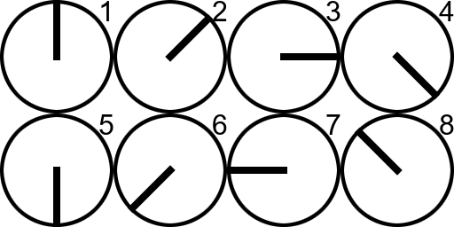
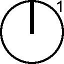

# Spritesheet to GIF

## Usage

Run the script with an image in the arguments.

`sprite2gif.py <input> <x frames> <y frames> <delay> [total frames] [autocrop] [output dir]`

`input` is the spritesheet you want to convert.

`x frames` is the number of horizontal frames in the spritesheet.

`y frames` is the number of vertical frames in the spritesheet.

`delay` is the time in between frames in milliseconds (1000ms = 1s).

`total frames` OPTIONAL*, specify the total amount of frames in case the spritesheet has empty space.***

`autocrop` OPTIONAL**, True or False, specify whether to automatically crop the gif to the most inclusive size.

`output dir` OPTIONAL, specify an output folder for the gif file (Useful for batch converting).

\* *REQUIRED if using the autocrop option*

\*\* *REQUIRED if using the output dir option*

\*\*\* *Enter 0 in total frames to enable auto-detect mode, which tries to remove empty frames from the end of the image.*

### Example

`python sprite2gif.py example/input.png 4 2 200 6`

Input:

Output:

## Requirements

[Pillow](https://pypi.org/project/Pillow/)
